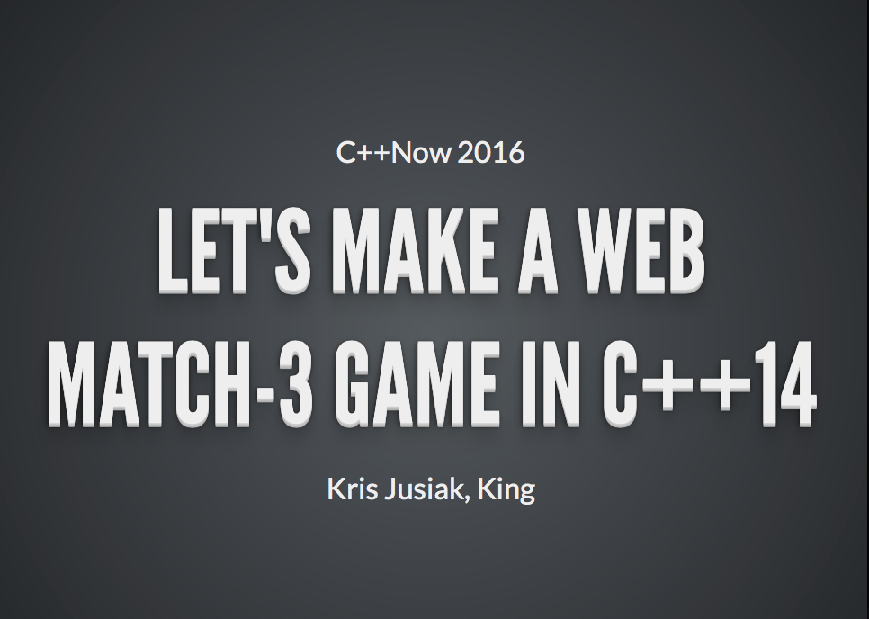

---------------------------------------

#Simple Match3 game in C++14 using SDL2 / MVC / Meta State Machine / Dependency Injection / Range-V3

| Play it! | Read about it |
| -------- | ------------- |
|  |  | |

---

###Requirements

* [Clang-3.7+](http://clang.llvm.org) / C++14 / STL
* [Emscripten - 1.35.0](http://kripken.github.io/emscripten-site/docs/getting_started/downloads.html)

###Dependencies

* [SDL2](https://www.libsdl.org/download-2.0.php)
* [SDL2-image](https://www.libsdl.org/projects/SDL_image/)
* [SDL2-ttf](https://www.libsdl.org/download-2.0.php)
* [boost.di](https://github.com/boost-experimental/di)
* [boost.msm-lite](https://github.com/boost-experimental/msm-lite)
* [range-v3](https://github.com/ericniebler/range-v3)

###Quick start

|          | Web                              | Desktop               |
| -------- | -------------------------------- | --------------------- |
| Download | <code>git clone --recurisve https://github.com/modern-cpp-examples/match3.git</code>                                            |
| Compile  | <code>make web</code>            | <code>make app</code> |
| Run      | <code>$browser index.html</code> | <code>./match3</code> |

